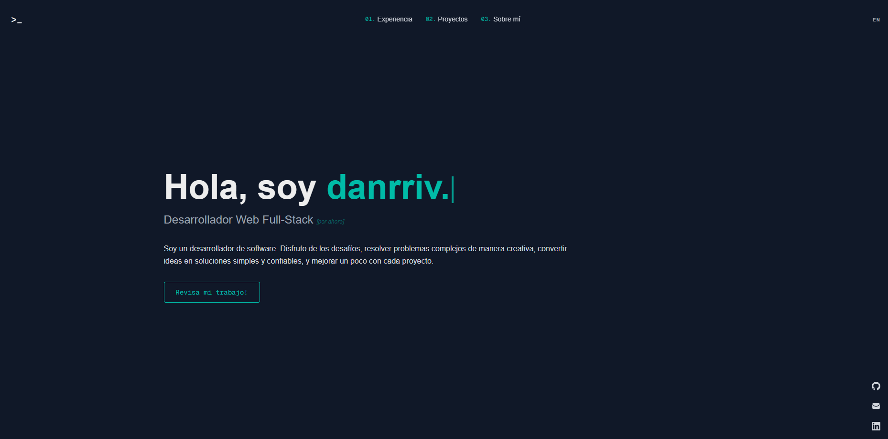

# Portfolio / Web Personal

> Sitio personal desarrollado con Nextjs 16 y Tailwind CSS, cuenta con localización además de usar la API de Spotify.


<p align="center">
  
</p>

## Dependencias
* [next-intl](https://next-intl.dev)
* [motion](https://motion.dev)
* [tailwind css](https://tailwindcss.com)


## Instalación

Asegúrate de tener instalado lo siguiente antes de iniciar el proyecto:

- [Node.js 20.9](https://nodejs.org/es/download) o superior . 
  > Recomendado: Node 24.13.0 LTS al ser la versión LTS mas reciente a la fecha. 

Puedes verificar tu versión con:

```bash
node -v
```

## Iniciar el proyecto
1. Instala las dependendecias
```bash
npm install
```
En caso de que uses [pnpm](https://pnpm.io/es/)
```bash
pnpm install
```
2. Inicia el proyecto de forma local
```bash
npm run dev
```

## Configurar el proyecto

Al usar `next-intl` para la localización, gran parte de los textos se encuentran en `/messages`, los idiomas se encuentran separados por carpetas, si quisieras agregar un idioma más, agrega una carpeta con su respectivo código de idioma.

```text
└── 📁messages
    ├── 📁en
    └── 📁es

```
Puedes adaptar los JSON que se encuentran en cada carpeta con tus datos, cada uno representa una sección de la web, también use [`t.rich`](https://next-intl.dev/docs/usage/translations#rich-text) para agregar estilos en el mismo JSON, puedes guiarte de la [documentación](https://next-intl.dev/docs/usage/translations) oficial si tienes dudas.
```json
{
    "Hero": {
        "greeting": "Hola, soy",
        "role": "Desarrollador Web Full-Stack <italic>[por ahora]</italic>",
        "intro": "Soy un desarrollador de software. Disfruto de los desafíos, resolver problemas complejos de manera creativa, convertir ideas en soluciones simples y confiables, y mejorar un poco con cada proyecto.",
        "cta": "Revisa mi trabajo!"
    },
    "NavSticky": {
        "display": {
            "experience": "experiencia",
            "projects": "proyectos",
            "about": "sobre-mí"
        },
        "experience": "Experiencia",
        "projects": "Proyectos",
        "about": "Sobre mí"
    },
    "Footer": {
        "built": "Hecho por <link>danrriv</link> con Nextjs. (aquí puedes colocar tu usuario) "
    }
}
```
### Spotify Widget
Para mostrar tu actividad musical en Spotify, necesitamos obtener un `Refresh Token`. Sigue estos pasos:

1. **Crea tu App:** Ve a [Spotify for Developers]() y crea una nueva aplicación.
2. **Credenciales:** Anota el **Client ID** y **Client Secret**, los usaremos más adelante.
3. **Configura el Redirect URI:** En los ajustes de tu App en Spotify, añade esta URL en el campo Redirect URIs:
   * `https://oauth.pstmn.io/v1/callback`(Si usas Postman).
4. **Obtén el Refresh Token via OAuth2:**
    * En Postman u otra herramienta de peticiones HTTP, ve a la pestaña **Authorization** y selecciona **OAuth 2.0**.
    * En la sección Configure New Token, llena los campos de la siguiente manera:
        * **Token Name**: (El nombre que tu prefieras)
        * **Grant Type**: Authorization Code
        * **Callback URL**: (Marca la casilla "Authorize using browser") o pega `https://oauth.pstmn.io/v1/callback` (o el callback de tu herramienta). 
        * **Auth URL**: https://accounts.spotify.com/authorize
        * **Access Token URL**: https://accounts.spotify.com/api/token
        * **Client ID**: TU_CLIENT_ID
        * **Client Secret**: TU_CLIENT_SECRET
        * **Scope**: user-read-currently-playing user-read-recently-played user-read-playback-position user-top-read (separados por espacios).
        * **Client Authentication**: Send as Basic Auth header.
        * Has click en "Get New Access Token"
    * Haz clic en Get New Access Token, inicia sesión en Spotify y autoriza tu App.

5. Postman te mostrará un `refresh_token`, cópialo en tus variables de entorno junto a los datos que obtuvimos en pasos anteriores:
```bash
# .env.local o .env.production  (en la raíz del proyecto)

SPOTIFY_CLIENT_ID=TU_CLIENT_ID
SPOTIFY_CLIENT_SECRET=TU_CLIENT_SECRET
SPOTIFY_REFRESH_TOKEN=TU_REFRESH_TOKEN
```
#### Nota
> El refresh token de tu app Spotify no expira hasta que le quites los permisos desde tu cuenta, y en caso que si.. ya sabes como obtener otro.

## Observaciones
* Tome inspiración de los proyectos de [Brittany Chang](https://v4.brittanychiang.com) y [midudev](https://porfolio.dev), agregando detalles adicionales como el widget de Spotify, y localización.
* Lo realicé como una práctica de Nextjs, si hay algo que mejorar, siéntete libre de hacerlo.
